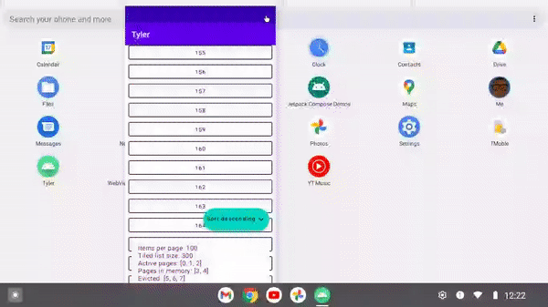
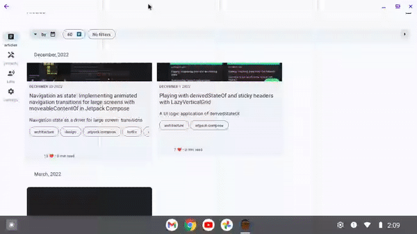

# Tiler

[](https://github.com/tunjid/Tiler/actions/workflows/tests.yml)


![badge][badge-ios]
![badge][badge-js]
![badge][badge-jvm]
![badge][badge-linux]
![badge][badge-windows]
![badge][badge-mac]
![badge][badge-tvos]
![badge][badge-watchos]

Please note, this is not an official Google repository. It is a Kotlin multiplatform experiment that makes no guarantees
about API stability or long term support. None of the works presented here are production tested, and should not be
taken as anything more than its face value.

## Introduction

Tiling is a state based paging implementation that presents a sublist of paged dataset in a simple `List`.
It offers constant time access to items at indices, and the ability to introspect the items paged through.

The following are examples of paged UI/UX paradigms that were built using tiling:

| [Basic pagination](https://github.com/tunjid/Tiler) | [Pagination with sticky headers](https://github.com/tunjid/Tiler) | [Pagination with search](https://github.com/tunjid/Musify) | [Pagination with placeholders](https://github.com/tunjid/me) |
|-----------------------------------------------------|-------------------------------------------------------------------|:----------------------------------------------------------:|:------------------------------------------------------------:|
|              |             |              |    |


For large screened devices:

| [Pagination with adaptive layouts](https://github.com/tunjid/Tiler) | [Pagination with adaptive layouts, search and placeholders]((https://github.com/tunjid/me)) |
|:-------------------------------------------------------------------:|:-------------------------------------------------------------------------------------------:|
|           |           |

Tiling is achieved with a Tiler; a pure function that has the ability to adapt any generic method of the form:

```kotlin
fun <T> items(query: Query): Flow<List<T>>
```

into a paginated API.

It does this using a `Tiler`:

```kotlin
fun interface ListTiler<Query, Item> {
    fun produce(inputs: Flow<Tile.Input<Query, Item>>): Flow<TiledList<Query, Item>>
}
```

* The [inputs](./implementation/primitives#inputrequest) modify the queries for data
* The output is the data returned over time in a `List` implementation: A `TiledList`.

Typical use of Tiling is the `toTiledList` extension on a `Flow<Query>`:

```kotlin
val pageRequestFlow = MutableSharedFlow<Tile.Input<Int, Item>>()

val items: Flow<TiledList<Int, Item>> = pageRequestFlow.toTiledList(
    listTiler(
        order = Tile.Order.Sorted(
            comparator = compareBy(Int::compareTo)
        ),
        limiter = Tile.Limiter(
            maxQueries = 3
        ),
        fetcher = { page ->
            repository.itemsFor(page)
        }
    )
)
```
Requests for pages are sent on each emission of `pageRequestFlow`:

```kotlin
// Request page 1
pageRequestFlow.emit(Tile.Request.On(1))

// Request page 5
pageRequestFlow.emit(Tile.Request.On(5))

// Stop updates from page 1
pageRequestFlow.emit(Tile.Request.Off(1))

// Delete cached results from page 1
pageRequestFlow.emit(Tile.Request.Evict(1)) 
```

For most practical purposes, the `TiledList` produced should be anchored or
["pivoted"](./implementation/pivoted-tiling) around a particular page; typically the user's
scroll position. For how to implement this with the library, see the
[basic example](./usecases/basic-example).

## Get it

`Tiler` is available on mavenCentral with the latest version indicated by the badge at the top of this readme file.

`implementation com.tunjid.tiler:tiler:version`

## License

    Copyright 2021 Google LLC

    Licensed under the Apache License, Version 2.0 (the "License");
    you may not use this file except in compliance with the License.
    You may obtain a copy of the License at

        https://www.apache.org/licenses/LICENSE-2.0

    Unless required by applicable law or agreed to in writing, software
    distributed under the License is distributed on an "AS IS" BASIS,
    WITHOUT WARRANTIES OR CONDITIONS OF ANY KIND, either express or implied.
    See the License for the specific language governing permissions and
    limitations under the License.

[badge-android]: http://img.shields.io/badge/-android-6EDB8D.svg?style=flat

[badge-jvm]: http://img.shields.io/badge/-jvm-DB413D.svg?style=flat

[badge-js]: http://img.shields.io/badge/-js-F8DB5D.svg?style=flat

[badge-js-ir]: https://img.shields.io/badge/support-[IR]-AAC4E0.svg?style=flat

[badge-nodejs]: https://img.shields.io/badge/-nodejs-68a063.svg?style=flat

[badge-linux]: http://img.shields.io/badge/-linux-2D3F6C.svg?style=flat

[badge-windows]: http://img.shields.io/badge/-windows-4D76CD.svg?style=flat

[badge-wasm]: https://img.shields.io/badge/-wasm-624FE8.svg?style=flat

[badge-apple-silicon]: http://img.shields.io/badge/support-[AppleSilicon]-43BBFF.svg?style=flat

[badge-ios]: http://img.shields.io/badge/-ios-CDCDCD.svg?style=flat

[badge-mac]: http://img.shields.io/badge/-macos-111111.svg?style=flat

[badge-watchos]: http://img.shields.io/badge/-watchos-C0C0C0.svg?style=flat

[badge-tvos]: http://img.shields.io/badge/-tvos-808080.svg?style=flat
